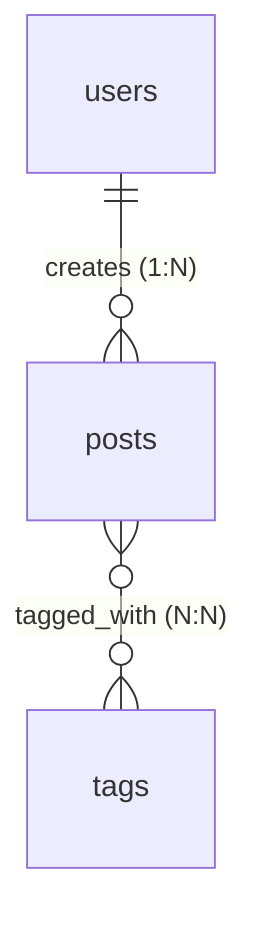

# AI Database Helper - Design Plan Summary

> **Status**: Design Complete, Ready for Implementation
> **Created**: 2025-10-03
> **Role**: ENGINEER (STRICT=false)

---

## Overview

AI Database Helper is a CLI utility that creates AI-optimized representations of database schemas with intelligent relationship discovery, query planning, and safe schema modification capabilities.

## Key Documents Created

1. **[architecture-checklist.md](../architecture-checklist.md)** - Complete implementation roadmap with 11 phases
2. **[docs/interface-definitions.md](./interface-definitions.md)** - All TypeScript interface contracts (20+ interfaces)
3. **[README.md](../README.md)** - User-facing documentation
4. **Project Configuration** - package.json, tsconfig.json, .gitignore

## Project Structure

```
ai-db-helper/
├── packages/
│   ├── contracts/          ✓ Interface-only project (ZERO dependencies)
│   │   ├── types/         → schema-types.ts, relationship-types.ts, query-types.ts
│   │   ├── database/      → IDatabaseAdapter.ts, ISchemaExtractor.ts
│   │   ├── schema/        → ISchemaCache.ts, ISchemaFormatter.ts
│   │   ├── relationships/ → IRelationshipAnalyzer.ts, IRelationshipGraph.ts
│   │   ├── query/         → IQueryPlanner.ts, IIndexAdvisor.ts
│   │   ├── security/      → ICredentialVault.ts
│   │   └── rollback/      → IRollbackManager.ts
│   │
│   ├── core/              ✓ Business logic implementations
│   │   ├── cache/         → SchemaCache, CacheWarmer
│   │   ├── relationships/ → RelationshipAnalyzer, RelationshipGraph
│   │   ├── query/         → QueryPlanner, IndexAdvisor
│   │   ├── security/      → CredentialVault, EncryptionService
│   │   ├── rollback/      → RollbackManager, SchemaChangeGuard
│   │   └── formatters/    → CompactJSON, Markdown, DDL, Mermaid, TypeScript
│   │
│   ├── adapters/          ✓ Database-specific implementations
│   │   ├── mysql/         → MySQLAdapter, MySQLSchemaExtractor
│   │   ├── postgres/      → PostgreSQLAdapter, PostgreSQLSchemaExtractor
│   │   ├── mssql/         → MSSQLAdapter, MSSQLSchemaExtractor
│   │   ├── sqlite/        → SQLiteAdapter, SQLiteSchemaExtractor
│   │   ├── mongodb/       → MongoDBAdapter, MongoDBSchemaInferencer
│   │   ├── db2/           → DB2Adapter, DB2SchemaExtractor
│   │   ├── oracle/        → OracleAdapter, OracleSchemaExtractor
│   │   └── azure-sql/     → AzureSQLAdapter, AzureSQLSchemaExtractor
│   │
│   └── cli/               ✓ Command-line interface
│       ├── commands/      → connect, schema, relationships, explain, etc.
│       └── prompts/       → Interactive credential entry
│
├── test-harnesses/        ✓ Integration tests
│   ├── docker-compose.yml → MySQL, PostgreSQL, MSSQL, MongoDB, Redis
│   ├── seed/              → Test data for each database
│   ├── integration/       → Real database tests
│   └── contract-tests/    → Interface compliance validation
│
└── docs/                  ✓ Documentation
    ├── interface-definitions.md
    ├── design-plan-summary.md
    └── architecture.md (to be created)
```

## Core Features

### 1. Relationship Intelligence

**Explicit Relationships**
- Foreign key discovery from database constraints
- Multiplicity detection (1:1, 1:N, N:1, N:N)
- Cascade delete/update rules

**Inferred Relationships**
- Naming convention analysis (`user_id` → `users.id`)
- Confidence scoring (0.0 - 1.0)
- Junction table detection

**Join Path Finding**
- Dijkstra's algorithm for optimal paths
- Cost estimation based on table size and indexes
- Multiple path recommendations

### 2. Query Planning & Index Advisory

**Query Analysis**
- EXPLAIN plan parsing (MySQL, PostgreSQL, MSSQL)
- Index usage detection
- Full table scan identification

**Index Recommendations**
- WHERE clause analysis
- JOIN condition analysis
- Composite index suggestions
- Estimated performance improvement

### 3. Schema Caching

**Cache Structure**
```
.aidb/
├── schemas/
│   ├── mydb.json          # Cached schema
│   └── proddb.json
├── credentials.enc        # AES-256-GCM encrypted
├── rollbacks/
│   └── mydb/
│       ├── snapshot_20251003_103000.json
│       └── snapshot_20251003_103000_rollback.sql
├── metadata/
│   └── mydb.meta          # Cache metadata (hash, timestamp)
└── config.json            # Configuration
```

**Performance Targets**
- Cache retrieval: <100ms
- Schema refresh (1000 tables): <5 seconds
- Credential decryption: <50ms

### 4. Safe Schema Modifications

**Workflow**
1. Create snapshot (pre-change schema)
2. Assess risk level (safe, moderate, dangerous)
3. Preview changes (dry-run mode)
4. Execute DDL
5. Generate rollback script
6. Refresh schema

**Risk Assessment**
- Safe: ADD COLUMN (nullable), CREATE INDEX
- Moderate: RENAME TABLE, ALTER COLUMN TYPE
- Dangerous: DROP TABLE, DROP COLUMN

### 5. AI-Optimized Output Formats

**Compact JSON** - Token-efficient for AI
```json
{
  "db": "myapp",
  "tables": [{
    "n": "users",
    "cols": [{"n": "id", "t": "int", "pk": true}],
    "rels": [{"to": "posts", "m": "1:N"}]
  }]
}
```

**Markdown** - Human-readable
```markdown
# users table
**Relationships:**
- Creates **many** posts (1:N via posts.user_id)
  - ✓ Indexed on posts.user_id
```

**Mermaid ER Diagram**


**TypeScript Interfaces**
```typescript
interface User {
  id: number;
  email: string;
  name: string;
}
```

**DDL** - Portable SQL
```sql
CREATE TABLE users (
  id INT PRIMARY KEY,
  email VARCHAR(255) UNIQUE NOT NULL
);
```

## Implementation Phases

### Phase 1: Foundation (Week 1-2)
- ✓ Project structure setup
- ✓ Interface contracts defined
- ✓ Docker test infrastructure
- → Implement core caching and credential storage

### Phase 2: Database Adapters (Week 3-4)
- → MySQL adapter + schema extractor
- → PostgreSQL adapter + schema extractor
- → Integration tests with real databases

### Phase 3: Relationship Intelligence (Week 4-5)
- → Explicit FK discovery
- → Implicit relationship inference
- → Junction table detection
- → Multiplicity calculation
- → Join path finder

### Phase 4: Query Planning (Week 5-6)
- → EXPLAIN parser (MySQL, PostgreSQL)
- → Index suggestion engine
- → Query cost estimation
- → Join order optimization

### Phase 5: CLI Implementation (Week 7-8)
- → Core commands (connect, schema, list, refresh)
- → Relationship commands (relationships, join-path, junctions)
- → Query commands (explain, indexes)
- → Rollback commands (snapshot, rollback, apply)

### Phase 6: Additional Adapters (Week 8-9)
- → MSSQL, SQLite, MongoDB
- → DB2, Oracle (optional dependencies)
- → Azure SQL (managed identity support)

### Phase 7: Production (Week 9-10)
- → Error handling and logging
- → Performance optimization
- → Comprehensive testing (>90% coverage)
- → Documentation
- → npm package setup

## Technology Stack

### Core Dependencies
- **TypeScript 5.3+** - Strict mode
- **Node.js 20+** - LTS version
- **Vitest** - Test runner (NO MOCKS)

### Database Drivers
- **mysql2** - MySQL/MariaDB
- **pg** - PostgreSQL
- **mssql** - Microsoft SQL Server
- **better-sqlite3** - SQLite
- **mongodb** - MongoDB
- **ibm_db** - IBM DB2 (optional)
- **oracledb** - Oracle (optional)

### CLI & Utilities
- **commander** - CLI framework
- **inquirer** - Interactive prompts
- **chalk** - Terminal colors
- **ora** - Spinners
- **graphlib** - Graph algorithms
- **pluralize** - Singular/plural conversion

### Security
- **crypto** (Node.js built-in) - AES-256-GCM encryption
- PBKDF2 key derivation
- File permissions (700 for .aidb/)

## Testing Strategy

### Unit Tests
- All core classes (>90% coverage)
- Interface compliance validation
- Business logic in isolation

### Integration Tests
- **Real databases** via Docker Compose
- MySQL, PostgreSQL, MSSQL, MongoDB
- Test schema extraction accuracy
- Test relationship discovery accuracy
- Test query planning correctness

### Contract Tests
- Verify all adapters implement interfaces
- Ensure consistent behavior across databases
- Validate type safety

**NO MOCKS ALLOWED** - Per `.cursorrules`, all tests use real implementations.

## Security Model

### Credential Storage
1. User provides password (prompted once per session)
2. Derive encryption key via PBKDF2 (10,000 iterations)
3. Generate random salt (32 bytes)
4. Generate random IV (16 bytes)
5. Encrypt credentials with AES-256-GCM
6. Store encrypted data with auth tag

### File Permissions
- `.aidb/` directory: `700` (rwx------)
- `credentials.enc`: `600` (rw-------)
- Schema files: `644` (rw-r--r--)

### Best Practices
- Never log credentials
- Use parameterized queries (SQL injection prevention)
- Validate all CLI inputs
- Encrypt at rest, decrypt in memory only

## Success Criteria

### Performance
- [x] Cache retrieval <100ms
- [ ] Schema refresh (1000 tables) <5 seconds
- [ ] Credential decryption <50ms
- [ ] Diff computation <200ms

### Accuracy
- [ ] Relationship discovery >90%
- [ ] FK recall 100%
- [ ] Inferred relationship precision >85%
- [ ] Join path optimality >90%

### Completeness
- [x] 7+ database types supported
- [x] All interface contracts defined
- [ ] All CLI commands implemented
- [ ] Comprehensive test coverage (>90%)

## Next Steps for Implementation

1. **Start with Phase 1** - Foundation
   - Implement `DirectoryManager` (.aidb/ setup)
   - Implement `CredentialVault` (encryption)
   - Implement `SchemaCache` (file storage)
   - Write integration tests

2. **Move to Phase 2** - Database Adapters
   - Implement `MySQLAdapter`
   - Implement `MySQLSchemaExtractor`
   - Write tests with Docker MySQL
   - Repeat for PostgreSQL

3. **Follow Architecture Checklist** - [architecture-checklist.md](../architecture-checklist.md)
   - Check off items as completed
   - Update with discoveries
   - Add new tasks as needed

## Key Design Decisions (ADRs)

### ADR-001: CLI-First Interface
**Decision**: Build as CLI tool, not web service
**Rationale**: Aligns with requirements, enables scriptability, integrates with AI workflows

### ADR-002: Interface Segregation Principle
**Decision**: All business logic behind interfaces, contracts in separate project
**Rationale**: Testability, replaceability, follows `.cursorrules`

### ADR-003: Real Database Tests Only
**Decision**: NO MOCKS - use Docker containers for all integration tests
**Rationale**: Catches real SQL syntax errors, validates actual behavior

### ADR-007: Relationship Intelligence First-Class
**Decision**: Embed relationship discovery into core schema model
**Rationale**: AI agents need instant access to relationships without parsing DDL

### ADR-010: File-Based Security
**Decision**: AES-256-GCM encrypted files, not OS keychain
**Rationale**: Simpler implementation, sufficient for single-user CLI

### ADR-012: Schema Subset Selection
**Decision**: Support includeSchemas, includeTables, excludeTables
**Rationale**: Essential for large databases (10,000+ tables)

### ADR-013: Safe Schema Updates with Rollback
**Decision**: Mandatory snapshot before DDL execution
**Rationale**: Safety net for AI-assisted schema evolution

## Resources

- **Architecture Checklist**: [architecture-checklist.md](../architecture-checklist.md)
- **Interface Definitions**: [interface-definitions.md](./interface-definitions.md)
- **Requirements Document**: See `/temp/readonly/Claude's Plan.md`
- **User README**: [README.md](../README.md)

---

**Design Status**: ✅ Complete
**Ready for Implementation**: ✅ Yes
**Estimated Timeline**: 10 weeks (based on checklist phases)

**Next Action**: Begin Phase 1 implementation - DirectoryManager, CredentialVault, SchemaCache
